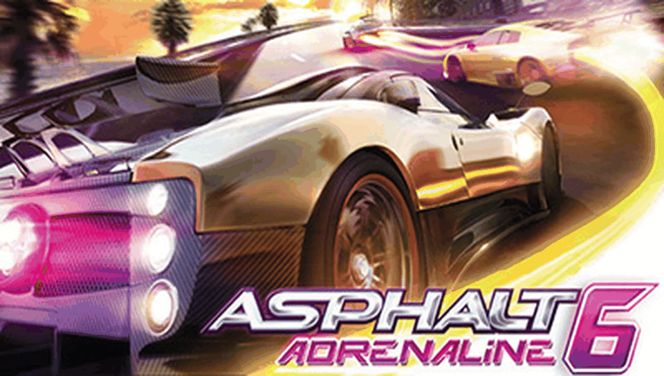

# ASPHALT 6 — PS Vita Port

<p align="center">
  
</p>

<p align="center">
  <b>Native port of Asphalt 6: Adrenaline (Gameloft) for PlayStation Vita and PlayStation TV.</b>
</p>

<p align="center">
  
  
  
  
  
</p>

---

## 📖 Description

**Asphalt 6: Adrenaline** is Gameloft's arcade racing game, originally released for Android as
`Asphalt-6-Adrenaline-v1.3.3-offline.apk` (package `com.gameloft.android.ANMP.GloftA6HP`). This
port runs the compiled native library (`libasphalt6.so` — Gameloft's proprietary **"Glitch"**
engine, derived from Irrlicht, with `gameswf` driving the Flash-based UI and `vox` handling
audio) directly on the PS Vita's ARM Cortex-A9 processor, using a dynamic loader (*soloader*)
and an Android environment emulation layer (*FalsoJNI*), with
[vitaGL](https://github.com/Rinnegatamante/vitaGL) providing the GLES 2.0/GLSL rendering
backend — the engine compiles its shaders at runtime, there is no fixed-function path.

The real game library is not shipped inside the visible APK: it lives inside a hidden,
already-"licensed" archive (`copy.inject`) bundled in the offline APK release, alongside
`pack.info` and the save-data defaults. See [`PORTING_PLAN.md`](PORTING_PLAN.md) for the full
engine-detection write-up.

### 🎮 Current Status: Alpha — Testing Only

> **This is an early alpha.** The game boots, reaches the main menu, and races are
> technically playable, but the overall experience is **far from acceptable** for regular
> play: frequent graphical glitches, aggressive FPS drops, and largely broken audio (see
> below). Only worth trying if you want to help test/debug the port — not as a way to
> actually play Asphalt 6 on Vita yet. See [`port_progress.md`](port_progress.md) for the
> full bug-by-bug diagnosis log (every fix is backed by a real console log/crash-dump — no
> guessing) and [`RELEASES.md`](RELEASES.md) for versioned release notes.

### ✨ What Works

- **Native ARM Execution**: `libasphalt6.so` (armeabi-v7a) runs directly on the Vita's CPU via
  the soloader — no interpretation/emulation of game code.
- **Boots to Title + Main Menu**: full JNI lifecycle bootstrap through `SO relocated` →
  `FalsoJNI initialized` → the Flash-based UI (`gameswf`) → `GS_MenuMain`, presenting frames
  continuously.
- **vitaGL Graphics Pipeline**: GLES 2.0 with the engine's GLSL shaders compiled in caching at
  runtime (via `vitaShaRK`), plus a set of speedhacks tuned specifically for this engine (see
  `CMakeLists.txt` and [`README VITAGL.md`](README%20VITAGL.md) for the full flag reference).
- **Touch Input**: the front touch panel is mapped 1:1 to the engine's own touch UI
  (`GLGame_nativeTouchPressed/Moved/Released`) — menus and in-race steering/controls work via
  touch.
- **Physical controls (Asphalt-5 style)**: D-Pad/stick left-right (plus L1/R1) steer via
  synthetic screen touches *and* the engine's native gamepad keys; SQUARE/CROSS hit the brake
  corners, TRIANGLE fires the floating nitro button, CIRCLE is BACK and START is MENU
  (`GLGame_nativeSetOnKeyDown/Up`, `source/input.c`). Synthetic touches share the same slot
  allocator as real fingers, so they can never collide.
- **Intro FMV**: the intro video plays through a software FFmpeg decoder.
- **Assets from `ux0:`**: resource loading reads the game's packed/loose asset files from
  `ux0:data/asphalt6/data/`.
- **Extensive on-device diagnostics**: a watchdog thread that reports live thread state and
  frame pacing, a breadcrumb ring buffer for the last intercepted calls, and a unified,
  spam-collapsing log sink — all built specifically to diagnose this engine without guessing
  (see `source/utils/watchdog.c`, `source/utils/breadcrumb.c`, `source/utils/logger.c`).

### ⚠️ Known Issues

**Confirmed on real hardware — the experience is currently far from acceptable:**

- **Audio: only the engine/motor sound plays.** `vox::DriverAndroid`'s race mix
  (`source/reimpl/audiotrack.c`) is the only audio actually audible on console. Menu music
  and SFX (`GLMediaPlayer`, samples packed in `file00a.bin`, mixed in
  `source/reimpl/gmp_audio.c`/`source/reimpl/soundpack.c`) are implemented in code but
  **don't come through on hardware** — no music, no crash/nitro/UI sound effects, just the
  car engine. Root cause not yet isolated (the code compiles and the mixer/pool logic runs,
  so this needs a fresh diagnosis pass against a real audio log, not another blind fix).
- **Graphical errors while textures load**: visible glitches/corruption tied to texture
  streaming during gameplay, separate from the vehicle-window issue below. Under active
  investigation.
- **Aggressive, frequent FPS drops during races**: frame pacing swings from a low-30s
  ceiling down to single digits mid-race, independent of the loading-screen stalls (see
  `port_progress.md`). A likely contributor (over-eager scene culling bypass) was split out
  behind the `RENDER_SCENE_CULLING_BYPASS` CMake option, but this has **not yet been
  confirmed on hardware** to fix the drops.
- **World geometry pop-in**: houses, trees, and road signs used to render at a very short
  distance and pop in right next to the car; a fix is in place (`port_progress.md`, Bug
  #041) but unverified on hardware.
- **In-race pause menu is broken**: the engine looks up its own pause-menu buttons
  (`menu_main`, `back_btn_main`, `custom_controls_btn`) by name and doesn't find them in this
  build's HUD/profile variant, so their visibility never updates correctly. A crash-avoidance
  guard is in place (Bugs #026–#028), but the menu itself still needs its underlying cause
  fixed — see `port_progress.md`.
- **Elements intermittently disappear during races** (including the player's car): confirmed
  via on-device diagnostics to correlate with real, CPU-bound multi-second stalls inside the
  engine's mesh-batching code (`CBatchDriver::thisAppendBatch`). Root cause narrowed down;
  actual fix still pending a dedicated reverse-engineering pass (see the Log 047 entry in
  `port_progress.md`).
- **Graphical glitch on vehicle windows**: caused by a car-reflection texture
  (`*_Fixed.PVRTC4.tga`) that was never extracted from the original APK data — a missing-asset
  issue, not a code bug.

None of this is a "just needs polish" situation yet — treat this port as a debugging target,
not a playable release. See [`RELEASES.md`](RELEASES.md) and `port_progress.md` for the full,
evidence-backed status of every issue above.

---

## 📋 Prerequisites

To run this port on your PS Vita or PS TV, you will need:

1. A PS Vita / PS TV console running Custom Firmware (**HENkaku** or **Enso**),
   firmware 3.60/3.65 or later recommended.
2. [**kubridge**](https://github.com/TheOfficialFloW/kubridge/releases) and
   [**FdFix**](https://github.com/TheOfficialFloW/FdFix/releases) installed as
   kernel plugins (`ur0:tai/config.txt` under `*KERNEL`).
3. [**libshacccg.suprx**](https://github.com/Rinnegatamante/ShaRKBR33D/releases/latest)
   installed in `ur0:data/` (required — the engine compiles its GLSL shaders at runtime).
4. A legally obtained copy of **Asphalt 6: Adrenaline** offline release
   (`Asphalt-6-Adrenaline-v1.3.3-offline.apk`, package `com.gameloft.android.ANMP.GloftA6HP`).

---

## 📦 Installation Instructions

1. Install the `asphalt6.vpk` file on your console using **VitaShell**.
2. On your PC, place `Asphalt-6-Adrenaline-v1.3.3-offline.apk` in the project root (or extract
   it into `asphalt6_extract/`).
3. Use **psvita-port-toolkit** (the standalone tool this port is managed with) to extract
   `libasphalt6.so` from the APK's hidden `copy.inject` archive and prepare the asset files —
   open the toolkit and select "Continuar con un port existente" pointing at this folder.
4. Transfer the resulting game data to `ux0:data/asphalt6/` via FTP or USB using VitaShell.

### Final File Structure in `ux0:data/asphalt6/`

```text
ux0:data/asphalt6/
├── libasphalt6.so     <- Native library extracted from the APK's hidden copy.inject archive
├── data/              <- Game data (packed file###.dat chunks, loose .swf/.tga/.mp4, pack.info)
├── logs/              <- Incremental debug logs (asphalt6_NNN.log)
└── cg/ glsl/          <- Shader cache (created at runtime/build)
```

---

## 🛠️ Building from Source

This port does **not** keep a local copy of `porting_tools/` — all build, deploy, log,
LiveArea, and crash-dump workflows are handled by **psvita-port-toolkit**, a standalone tool
kept outside this repository.

### Build Prerequisites

- **VitaSDK**, fully compiled with softfp usage (`vitasdk-softfp/vdpm`).
- VitaSDK libraries: `vitaGL`, `vitashark`, `kubridge`, `pthread`.
- FFmpeg static libraries (`avformat`, `avcodec`, `swresample`, `avutil`, `mp3lame`) for the
  software intro-video decoder.
- CMake and Make.

### Build Steps

```bash
cmake -Bbuild .
cmake --build build
```

This produces `build/asphalt6.vpk`. For day-to-day development (build + deploy + crash-dump
parsing), use **psvita-port-toolkit** instead of raw `cmake`/`make`.

---

## 🏗️ Project Structure

- `source/`: Native C/C++ loader — lifecycle (`main.c`, `java.c`, `dynlib.c`), the engine's
  runtime ARM patch set (`patch.c`, one confirmed bug/hook at a time), and video/input
  (`video.cpp`, `input.c`).
- `source/reimpl/`: Minimal reimplementations of the Android surfaces the engine expects (EGL,
  asset manager, memory, pthreads, errno, 64-bit time).
- `source/utils/`: On-device diagnostics — `watchdog.c` (thread/frame-pacing heartbeat),
  `breadcrumb.c` (ring buffer of intercepted calls), `logger.c` (unified, spam-collapsing log
  sink for the game's own logs plus vitaGL/FalsoJNI).
- `lib/`: Auxiliary libraries (`so_util`, `falso_jni`, `vitaGL`, `libc_bridge`, `fios`,
  `kubridge`, `sha1`).
- `extras/`: LiveArea assets (`icon0.png`, `bg0.png`, `pic0.png`, `startup.png`,
  `template.xml`).
- `PORTING_PLAN.md`: Living plan — engine findings, JNI export table, checklist.
- `port_progress.md`: Bug-by-bug diagnosis log, one confirmed bug at a time, backed by real
  console logs and crash dumps.
- [`RELEASES.md`](RELEASES.md): Versioned release notes — what works and what's known-broken
  per release, distilled from `port_progress.md`.
- [`README VITAGL.md`](README%20VITAGL.md): Reference for vitaGL's own build flags (including
  the speedhacks this port enables/avoids and why).

---

## ⚖️ Disclaimer

**Asphalt 6: Adrenaline** is a registered trademark of Gameloft. The work presented in this
repository is not "official" or produced or sanctioned by Gameloft or any other registered
trademark mentioned in this repository.

This software does not contain the original code, executables, assets, or other
non-redistributable parts of the original game product. The authors of this work do not
promote or condone piracy in any way. To launch and play the game on their PS Vita device,
users must possess their own legally obtained copy of the game in the form of an `.apk` file.

---

## 👥 Credits and Acknowledgements

- **Gameloft**: Original developers of Asphalt 6: Adrenaline and the "Glitch" engine.
- **TheFloW**: For `so_util`, `kubridge`, `FdFix`, and foundational techniques for loading
  Android executables on PS Vita.
- **Rinnegatamante**: For `vitaGL` and continued support to the PS Vita porting scene.
- **v-atamanenko**: For `FalsoJNI` and the `soloader-boilerplate` base template.
- **FFmpeg**: For the software video decoder used to play the intro FMV.
- **Vita Community**: To all developers and enthusiasts in the PS Vita homebrew community.

---

## License

This software may be modified and distributed under the terms of the MIT license.
See the [LICENSE](LICENSE) file for details.
